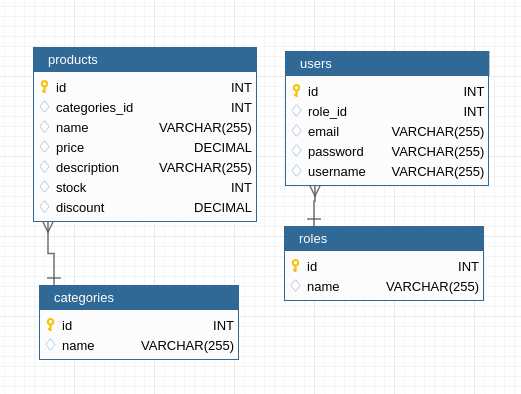

# Temática del sitio

En nuestro sitio web, nos enfocaremos en brindar una amplia variedad de productos y servicios relacionados con los sandwiches para satisfacer los gustos y necesidades de nuestros clientes. Nuestro objetivo es ofrecer una experiencia deliciosa y conveniente que impulse a nuestros clientes a volver una y otra vez.

**Productos y servicios:**

1. **Sandwiches clásicos**: Ofreceremos una selección de sandwiches clásicos como el BLT, el pollo a la parrilla, el club y el sándwich de pavo, para complacer a los amantes de los sabores tradicionales.

2. **Sandwiches gourmet**: Para los paladares más exigentes, tendremos una línea de sandwiches gourmet que incluirán ingredientes premium y combinaciones únicas para una experiencia gastronómica especial.

3. **Opciones vegetarianas y veganas**: Reconocemos la importancia de brindar opciones para clientes con preferencias alimenticias específicas. Por ello, ofreceremos una variedad de sandwiches vegetarianos y veganos creativos y deliciosos.

4. **Personalización**: Permitiremos a nuestros clientes construir su propio sandwich, eligiendo ingredientes, pan y aderezos para adaptarlo a sus gustos personales.

5. **Combos y complementos**: Para una experiencia completa, ofreceremos combos que incluyan papas fritas, ensaladas y bebidas para satisfacer el hambre de nuestros clientes.

**Audiencia objetivo:**
Nuestra audiencia objetivo abarcará a diferentes grupos:

1. **Amantes de la comida rápida**: Atraeremos a aquellos que buscan una opción deliciosa y rápida para satisfacer su apetito en cualquier momento del día.

2. **Profesionales ocupados**: Nuestros sandwiches serán una solución práctica para aquellos que no tienen tiempo para cocinar, pero desean una comida sabrosa durante su descanso o almuerzo.

3. **Estudiantes y jóvenes adultos**: Captaremos la atención de estudiantes universitarios y jóvenes adultos que buscan una opción accesible y deliciosa para sus comidas diarias.

4. **Personas con dietas específicas**: Nuestra oferta de opciones vegetarianas y veganas atraerá a aquellos que buscan alternativas sustanciales y deliciosas a base de plantas.

**Ajuste de oferta al público objetivo:**
Para ajustar nuestra oferta a la audiencia objetivo, implementaremos las siguientes estrategias:

1. **Personalización**: Brindaremos opciones de personalización para que nuestros clientes puedan adaptar sus sandwiches según sus preferencias y necesidades alimenticias.

2. **Promociones y descuentos**: Lanzaremos ofertas y promociones especiales para estudiantes y clientes habituales, lo que les permitirá obtener sus sandwiches favoritos a precios atractivos.

3. **Marketing en redes sociales**: Utilizaremos plataformas de redes sociales para llegar a nuestros clientes potenciales, compartiendo imágenes atractivas de nuestros deliciosos sandwiches y promociones especiales.

## Breve descripción de los integrantes del equipo

- Gabriel Alejandro Mamani: Adorador de gatos.
- Carolina de los Angeles Cortez: Me gusta el diseño, también los gatos.
- Micaela Zerpa: Estudiante con ganas de aprender y también me gustan los gatos.

## Instrucciones

- Importar el script sql que está en el directorio `mysql` a la base de datos.

- El correo electronico del usuario administrador es `admin@gmail.com` y la contraseñas es `123ok`.

## Sitios referentes

- [Nuria](https://www.nuria.com.ar/producto/triples-rucula-y-queso)
- [Parma sandwiches](http://parmasandwiches.com.ar)
- [La espiga de oro pilar](https://www.laespigadeoropilar.com.ar/product-page/sandwiches-de-miga-premium)
- [Sanduba](https://www.sanduba.com.ar)
- [Ninina](https://ninina.com/collections/sandwiches)
- [Wireframe 1 - Pinterest](https://ar.pinterest.com/pin/4925880834938551)
- [Wireframe 2 - Pinterest]( https://ar.pinterest.com/pin/258745941081872529/)
- [Wireframe 3 - Pinterest](https://ar.pinterest.com/pin/797981627750078513/)
- [Wireframe 4 - Pinterest](https://ar.pinterest.com/pin/327636941651828236/)
- [Wireframe 5 - Pinterest](https://ar.pinterest.com/pin/405183297736784752/)
- [Wireframe 6 - Pinterest](https://ar.pinterest.com/pin/780741285415899055/)

## Enlace al wireframe

[Link Figma](https://www.figma.com/file/LRzGn4ZlnLizWbAvRx4Vdq/Sandwich-E-commerce?type=design&node-id=0-1&mode=design&t=IgG0piQngLnrVtF7-0)

## Enlace al tablero de trabajo

[Tablero - Trello](https://trello.com/b/sKstrtGd/proyecto-integrador)

## Diagrama de entidad relación

